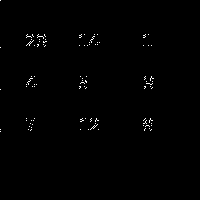

# Work on [https://www.reddit.com/r/CracktheCode/comments/7xjjw7/dark_souls_iii_dlc/](https://www.reddit.com/r/CracktheCode/comments/7xjjw7/dark_souls_iii_dlc/)

Sorry if I didn't link some source of code I used to inspire myself. Feel free to open an issue if so. But this was just playing code.

# For the first part (AAAAA)

```
A cyclic flag with n stripes on c colors is a configuration of n colored stripes, with c possible colors, arranged in a cyclic pattern. Rotating or reflecting a cyclic flag yields the same flag. Here you can find some examples of this: https://imgur.com/liNG9QJ. Let a be AAAAA converted from base 36 to base 10. Let x be the number of cyclic flags on 10195271 stripes with 19 colors. Then x mod 72002149 - 38722868 = a.
```

Find my code for it at [first_part.py](first_part.py).

Which will output:

```
x: 1240204764490253033472000
pre_a:20368565
AAAAA is:
C4KHH
Or... unprobably: 
-2LEF
```

I think it's probably wrong as I oversimplified the interpretation of the flags stuff.

# For the second part (BBBBB)

BBBBB is:

AAAAA

What I did was (find it in [decrypt2.py](decrypt2.py)) parse the PNG image by myself. Decompress the image part by myself... into a .ppm image (the simplest image format I could find) by using all the pixels that have some alpha value bigger than 0.

That gets us the image:



I interpret those numbers as:
```
[[23, 14, 1], [4, 5, 9], [7, 12, 6]]
```

Which is a 3x3 matrix. What cyphering uses a 3x3 matrix? A quick google revealed that its a Hill Cipher.

I found some implementation on the internet from [here](https://github.com/rhtyd/hacklab/blob/master/labwork/Security/hill-cipher.py) and modified it to work with what we got. Find it in [hill_cipher.py](hill_cipher.py)

Given I was not sure what the image matrix said in some points I just tried my different interpretations of the image. And with different alphabets (with space, without, with numbers, without, numbers before letters...etc).

I finally got to the only combination that gave something... uhm suspicious.

```
With key: [[23, 14, 1], [4, 5, 9], [7, 12, 6]]
key as str: XOBEFJHMG
used alpha: ABCDEFGHIJKLMNOPQRSTUVWXYZ
[ALPHA LENGTH]:  26
Result of decyphering text:
AAAAAAAAAAAAAAAAAAAAAAAAAAAAAAAAAAAAAAAAAAAAAAAAAAAAAAAAAAAAAAAAAAAAAAAAAAAAAAAAAAAAAAAAAAAAAAAAAAAAAAAAAAAAAAAAAAAAAAAAAAAAAAAAAAAAAAAAAAAAAAAAAAAAAAAAAAAAAAAAAAAAAAAAAAAAAAAAAAAAAAAAAAAAAAAAAAAAAAAAAAAAAAAAAAAAAAAAAAAAAAAAAAAAAAAAAAAAAAAAAAAAAAAAAAAAAAAAAAAAAAAAAAAAAAAAAAAAAAAAAAAAAAAAAAAAAAAAAAAAAAAAAAAAAAAAAAAAAAAAAAAAAAAAAAAAAAAAAAAAAAAAAAAAAAAAAAAAAAAAAAAAAAAAAAAAAAAAAAAAAAAAAAAAAAAAAAAAAAAAAAAAAAAAAAAAAAAAAAAAAAAAAAAAAAAAAAAAAAAAAAAAAAAAAAAAAAAAAAAAAAAAAAAAAAAAAAAAAAAAAAAAAAAAAAAAAAAAAAAAAAAAAAAAAAAAAAAAAAAAAAAAAAAAAAAAAAAAAAAAAAAAAAAAAAAAAAAAAAAAAAAAAAAAAAAAAAAAAAAAAAAAAAAAAAAAAAAAAAAAAAAAAAAAAAAAAAAAAAAAAAAAAAAAAAAAAAAAAAAAAAAAAAAAAAAAAAAAAAAAAAAAAAAAAAAAAAAAAAAAAAAAAAAAAAAAAAAAAAAAAAAAAAAAAAAAAAAAAAAAAAAAAAAAAAAAAAAAAAAAAAAAAAAAAAAAAAAAAAAAAAAAAAAAAAAAAAAAAAAAAAAAAAAAAAAAAAAAAAAAAAAAAAAAAAAAAAAAAAAAAAAAAAAAAAAAAAAAAAAAAAAAAAAAAAAAAAAAAAAAAAAAAAAAAAAAAAAAAAAAAAAAAAAAAAAAAAAAAAAAAAAAAAAAAAAAAAAAAAAAAAAAAAAAAAAAAAAAAAAAAAAAAAAAAAAAAAAAAAAAAAAAAAAAAAAAAAAAAAAAAAAAAAAAAAAAAAAAAAAAAAAAAAAAAAAAAAAAAAAAAAAAAAAAAAAAAAAAAAAAAAAAAAAAAA
```

What are the chances of getting that big chunk of text to decipher into ALL As? I'm not good at math, but probably very low.

So I'm gonna guess the BBBBB part is actually whatever you got in the AAAAA part of the challenge. Maybe the CCCCC part has something saying what else is needed.

Or I may be completely wrong haha


# For the third part (CCCCC)

Find my work on [third_part.py](third_part.py) and [third_part2.py](third_part2.py).

If you look closely the image contains a QRcode.

Re-generating the QRcode and scanning it will most probably give you the CCCCC, or even a text saying what to do with AAAAA & BBBBB.

I generated a lot of images...

I tried to filter the image by moving to HSV color space and filter by value.

1[qrcode_appearing.gif](qrcode_appearing.gif)

From that images I tried to re-generate the QRcode taking into account its a 210x210 pixel images where every 10 pixels would represent a bit. So if I have enough white pixels in a 10x10 square that may be a colored square.

I had no idea what would be a good strategy so I just bruteforced generating a big bunch of them.

Random results:


All images are in the [generated_images](generated_images) folder.

Even tho if you execute the python files they will be generated in the folder of the script.


